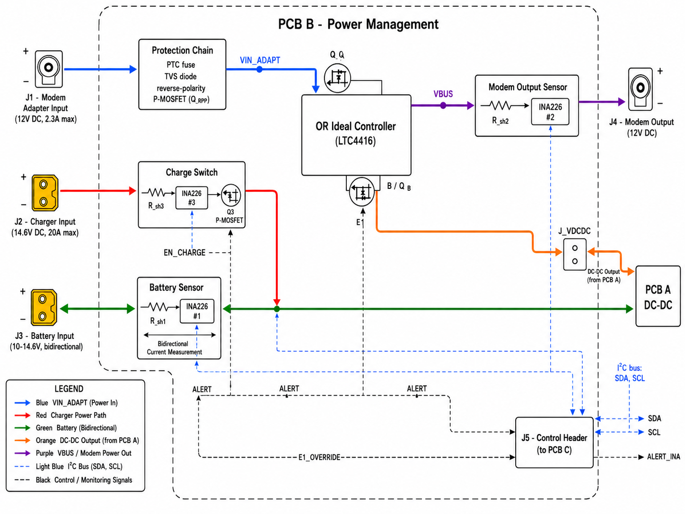

# DC UPS for WiFi Modem

[](https://opensource.org/licenses/MIT)
[](https://ohwr.org/cern_ohl_p_v2.txt)
[](https://creativecommons.org/licenses/by/4.0/)
[](https://www.kicad.org/)
[](https://www.espressif.com/en/products/socs/esp32-c6)
[](#project-status)

An open hardware DC UPS system designed to keep a WiFi modem running during
power outages. Built around a LiFePO4 battery, a smart charger, and a
custom three-PCB architecture that minimizes power conversion losses and
maximizes battery lifespan.

This project is developed as personal infrastructure for use in Costa Rica
(where power outages are frequent enough to disrupt remote work) and as
educational material for the VLSI specialization program at Universidad
Latina de Costa Rica.

---

## Architecture



The system uses three independent power paths converging at the modem
input via an Ideal OR controller:

1. **Normal operation:** AC mains → Modem AC/DC adapter → OR Ideal channel A → Modem
2. **Battery charging:** AC mains → LiTime 14.6V/20A charger → MCU-controlled switch → LiFePO4 battery
3. **Backup during outage:** Battery → DC-DC buck-boost → OR Ideal channel B → Modem

This architecture preserves the charger's native three-stage CC-CV-cutoff
logic by isolating it from the modem load, allows the modem to be powered
directly by its original adapter in normal operation (avoiding unnecessary
double conversion), and keeps the DC-DC converter in low-power standby
most of the time.

## Key Specifications

| Parameter | Value |
|-----------|-------|
| Battery | LiTime 12V 50Ah LiFePO4 (640 Wh) |
| Charger | LiTime 14.6V / 20A (recharge time ~2.5 h) |
| Modem output | 12V DC, 2.3A continuous (28 W) |
| Estimated backup runtime | ~24 hours at typical modem load |
| MCU | ESP32-C6 (RISC-V, WiFi 6, Bluetooth 5.0) |
| Connectivity | USB-C, WiFi (MQTT), Bluetooth LE |
| Self-test | Automatic monthly + manual (button) + remote (BLE) |

## Repository Structure

```
ups-modem/
├── docs/                    # Design documentation, guides, architecture diagrams
├── datasheets/              # Component datasheets (reference copies)
├── pcb-a/                   # PCB A — DC-DC Buck-Boost (LM5176)
├── pcb-b/                   # PCB B — Power Management (LTC4416, INA226 sensors)
├── pcb-c/                   # PCB C — Control & UI (ESP32-C6)
├── shared-libs/             # Custom KiCad symbols/footprints shared across PCBs
├── firmware/                # ESP32-C6 firmware (to be implemented)
├── mechanical/              # Enclosure designs (to be implemented)
├── LICENSES/                # Full text of all licenses used
├── LICENSE                  # Primary license (MIT)
├── LICENSES.md              # Multi-license scheme explanation
└── README.md                # This file
```

## Documentation

The following design documents are available in [`docs/`](docs/):

- **[PCB A Design Document](docs/PCB_A_Documentacion_Diseno.docx)** — DC-DC buck-boost converter (LM5176, 11.8V output)
- **[PCB B Design Document v2.0](docs/PCB_B_Documentacion_Diseno_v2.docx)** — Power management, OR Ideal, charge switch, three INA226 current sensors
- **[PCB C Design Document v2.0](docs/PCB_C_Documentacion_Diseno_v2.docx)** — ESP32-C6 control board, OLED UI, BLE app interface
- **[PCB B KiCad Schematic Capture Guide](docs/PCB_B_KiCad_Schematic_Guide.docx)** — Step-by-step schematic capture instructions for KiCad 10.0

## Project Status

This project is **in active development**. Current state by component:

| Component | Status |
|-----------|--------|
| Architecture & design documents | ✅ Complete (v2.0) |
| PCB B schematic capture | 🔄 In progress |
| PCB A schematic capture | ⏳ Pending |
| PCB C schematic capture | ⏳ Pending |
| PCB layouts (all) | ⏳ Pending |
| Prototype fabrication | ⏳ Pending |
| Firmware | ⏳ Pending |
| Enclosure design | ⏳ Pending |
| System integration & validation | ⏳ Pending |

## Tools

- **EDA:** [KiCad 10.0](https://www.kicad.org/)
- **MCU framework:** [ESP-IDF](https://github.com/espressif/esp-idf)
- **RTOS:** FreeRTOS (included with ESP-IDF)
- **BLE stack:** NimBLE (included with ESP-IDF)
- **BLE testing app:** [nRF Connect for Mobile](https://www.nordicsemi.com/Products/Development-tools/nRF-Connect-for-mobile) (Nordic Semiconductor)

## License

This project uses **multiple licenses** depending on the type of content:

- **Firmware:** [MIT License](LICENSES/MIT.txt)
- **Hardware designs:** [CERN-OHL-P v2](LICENSES/CERN-OHL-P-v2.txt)
- **Documentation:** [Creative Commons Attribution 4.0](LICENSES/CC-BY-4.0.txt)
- **Datasheets:** Copyright of their respective manufacturers (reference only)

See [`LICENSES.md`](LICENSES.md) for the complete licensing scheme and
rationale behind each choice.

## Acknowledgements

- **LiTime** for the LiFePO4 battery and matching charger
- **Texas Instruments** and **Analog Devices** for excellent documentation and reference designs
- **Espressif** for the ESP32-C6 module with integrated WiFi 6 and BLE
- **CERN** for the Open Hardware License, which makes projects like this possible
- The **KiCad** community for the EDA tool that powers this design

## Author

**Carlos Ruiz Mora** ([@caruizmo-git](https://github.com/caruizmo-git))

Hardware and firmware validation engineer; professor at Universidad Latina
de Costa Rica.

---

*This project is part of personal infrastructure for resilient connectivity
in Costa Rica and serves as educational material in pre-silicon design and
verification coursework.*
